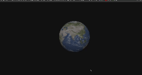

# The World Three.JS

## Overview

Welcome to **The World Three.JS**! This project uses [Three.js](https://threejs.org/) to create an immersive and interactive 3D world in the browser.

## Demo



## Features

- **3D Rendering**: High-quality graphics using Three.js.
- **Interactive Elements**: Dynamic user interactions.
- **Customizable Scenes**: Easy customization of scenes, objects, and animations.
- **Responsive Design**: Works across various devices and screen sizes.

## Technologies Used

- **Three.js**
- **JavaScript**
- **HTML/CSS**
- **WebGL**
- **Vite**

## Getting Started

### Prerequisites

- [Node.js](https://nodejs.org/)
- [npm](https://www.npmjs.com/)

### Installation

**Install dependencies:**

```sh
npm install
npm run dev
```
Open your browser and go to http://localhost:3000.

